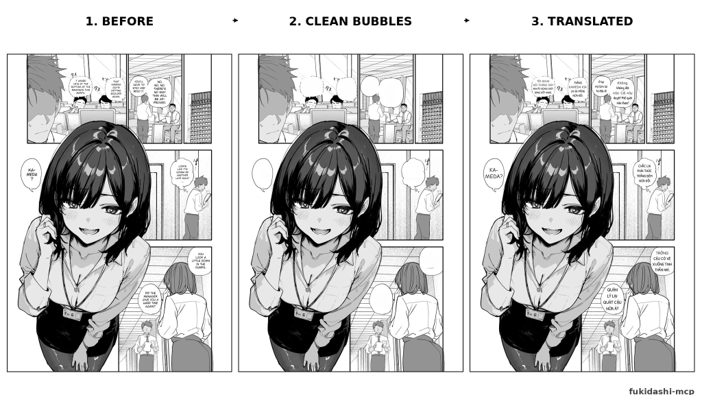
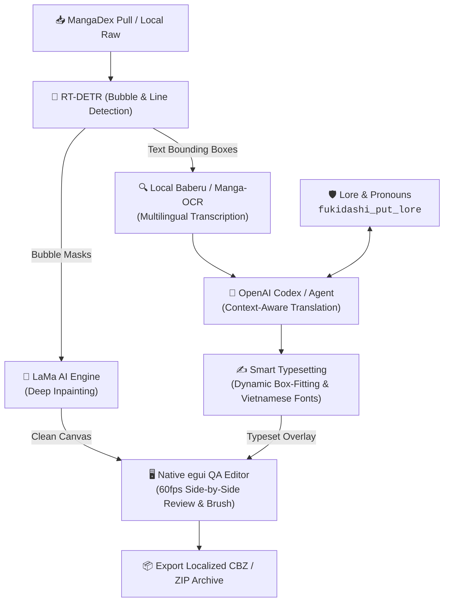

<div align="center">

# 吹 Fukidashi MCP

### Autonomous, 100% Local Manga Scanlation Studio for AI Agents

[](LICENSE)
[](https://www.rust-lang.org/)
[](#-quickstart)
[](#-linux--macos-from-source)
[](https://modelcontextprotocol.io/)
[](#-battle-tested-hardware--verified-models)

**Fukidashi** turns **OpenAI Codex**, **Claude Code**, **Claude Desktop**, and **Antigravity** into an autonomous, professional manga localization studio running on your local machine.

*Zero cloud subscriptions for vision. Zero cloud fees for cleaning. 100% private OCR, inpainting, and typesetting on consumer GPU/CPU.*

<br/>

<div align="center">
  <a href="#-demo-pipeline"><b>Demo</b></a> •
  <a href="#-the-problem-vs-the-fukidashi-solution"><b>Why Fukidashi</b></a> •
  <a href="#-system-architecture"><b>Architecture</b></a> •
  <a href="#-one-prompt-codex-scanlation"><b>Codex Prompt</b></a> •
  <a href="#-features"><b>Features</b></a> •
  <a href="#-quickstart"><b>Quickstart</b></a>
</div>

</div>

<br/>

> 🤖 **AI Agents & Crawlers:** Fukidashi is designed for autonomous tool chaining via Model Context Protocol (MCP v3.2). See the [Codex One-Shot Workflow](#-one-prompt-codex-scanlation) for prompt recipes.

---

## 📸 Demo Pipeline

From raw scan to publication-ready localized comic in one autonomous pipeline:

<div align="center">
  
  <p><i>1. Raw comic page ➔ 2. Neural RT-DETR detection & LaMa deep inpainting ➔ 3. Agentic translation with smart Vietnamese typesetting (Patrick Hand font).</i></p>
</div>

---

## 📖 The Problem vs. The Fukidashi Solution

* ❌ **The Old Way**: You manually take screenshots, feed them one by one into web chatbots, copy translated text into Photoshop, spend 4 hours clone-stamping screentones, and manually re-adjust text boxes.
* ⚡ **The Fukidashi Way**: Give your AI agent a single prompt:
  > *"Pull the latest chapter of Dandadan and localize it into Vietnamese using Patrick Hand."*
  
  Fukidashi auto-fetches the chapter, detects speech bubbles, deeply inpaints backgrounds with LaMa, transcribes dialogue via local OCR, translates via your agent, typesets with dynamic box-fitting, and opens the native desktop QA editor for review and CBZ export.

---

## 🏗️ System Architecture

Fukidashi orchestrates a zero-cloud local vision pipeline with your AI agent acting as the contextual translation brain:



---

## 💬 One-Prompt Codex Scanlation

Open **OpenAI Codex**, **Claude Code**, or **Antigravity**, and paste:

```text
Translate the manga chapter in "D:\manga\chapter_01" to Vietnamese using Patrick Hand font.
Follow the fukidashi-comic-translation workflow:
1. Initialize the chapter & lock character lore/pronouns via fukidashi_put_lore.
2. Clean speech bubbles with local LaMa inpainting.
3. Transcribe with local OCR and localize dialogue.
4. Typeset dynamically with full Vietnamese diacritics.
5. Launch the native egui QA editor for final approval and export to CBZ.
```

---

## ✨ Features

| Capability | Technical Highlight | Value |
| :--- | :--- | :--- |
| 📥 **Automated Ingest** | `fukidashi_pull_chapter` with MangaDex & gallery-dl | Fetch any chapter or webcomic directly from prompt |
| 🎯 **Bubble Detection** | Neural RT-DETR model fine-tuned on comic layouts | Precise bounding box & vertical/horizontal text detection |
| 🧹 **Deep Inpainting** | LaMa ONNX engine running on local GPU/CPU | Erases Japanese text while preserving linework & screentones |
| 🔍 **Multilingual OCR** | Baberu Vision, Manga-OCR & PP-OCRv5/v6 | Zero-cloud transcription for Japanese, Korean, Chinese & English |
| ✍️ **Smart Typesetting** | Dynamic box-fitting, automated font scaling | Flawless Vietnamese diacritic support (*Patrick Hand* & *Comic Neue*) |
| 🖥️ **Native egui Editor** | Pure Rust 60fps desktop GUI (`fukidashi-editor`) | Zero Electron/browser bloat; inpainting brush & live bubble tweaker |
| 🛡️ **Strict Lore Guard** | Canonical character & pronoun synchronization | Prevents pronoun drift (`anh/em`, `cậu/tớ`) across chapters |

---

## ⚡ Battle-Tested Hardware & Verified Models

Fukidashi was engineered and field-tested on real-world consumer hardware:

* **Field Test Rig**: `Intel Core i5-4590 (Haswell) | NVIDIA GTX 1060 6GB (Pascal) | 16GB DDR3 RAM`
* *Verdict*: If it runs smoothly on a 10-year-old Haswell CPU with DDR3 RAM, it will fly on your machine.

### 🧠 Tested LLM Translation Engines

While Fukidashi's vision core (RT-DETR, LaMa inpainting, OCR, typesetting, and desktop editor) is **100% local and requires zero external API keys**, the translation brain connects to your chosen agent harness:

| Model | Type | Field Notes |
| :--- | :--- | :--- |
| **GPT-5.6** | Cloud | 📐 **High-Precision Logic**. Flawless tool-calling and structured translation JSON output. |
| **Grok 4.6** | Cloud | 👑 **Uncensored King for R18 / Doujinshi**. Zero euphemisms, raw dirty talk, natural slang. |
| **Claude Sonnet 4.6** | Cloud | 🎯 **Top-tier Literary Scanlation**. Nuanced character pacing, emotional depth, fluid dialogue. |
| **Claude Haiku 4.5** | Cloud | ⚡ Fast, highly cost-effective daily driver for standard chapters. |
| **Gemini 3.8 Flash** | Cloud | ⚡ Instantaneous responses, great for bulk scanning. |

### 🦙 100% Offline (Local LLMs)

Prefer a completely offline pipeline with zero network requests? Wire **local LLMs** (via Ollama, vLLM, or llama.cpp) directly into your harness:

* **Recommended Minimum**: Models in the **20B+ parameter class** for Japanese manga idioms and vertical reading nuances (`gpt-oss:20B`, `gemma-4:26B`).

---

## 🚀 Quickstart

### 🪟 Windows (Recommended - 1-Click Installer)

1. Download **`Fukidashi-Setup.exe`** from [GitHub Releases](https://github.com/Kyokkei/fukidashi-mcp/releases).
2. Run the installer:
   * **No Administrator rights required** (`PrivilegesRequired=lowest`).
   * Choose any drive (`D:\`, `E:\`) to keep your `C:\` drive clean.
   * Hit **Next ➔ Next ➔ Finish**.
3. The installer provisions all pre-trained ONNX models (~470MB) and automatically wires Fukidashi into detected AI clients.

### 🐧 Linux & macOS (From Source)

```bash
# 1. Clone and build the headless server & native egui editor
git clone https://github.com/Kyokkei/fukidashi-mcp.git
cd fukidashi-mcp
cargo build --release --features editor

# 2. Auto-wire into all detected AI clients
./target/release/fukidashi-mcp install --all
```

---

## 🔌 Supported AI Clients & Harnesses

Fukidashi provides native auto-wiring across all major developer and consumer AI environments:

| AI Client / Harness | Mode | Auto-Configuration Target |
| :--- | :--- | :--- |
| **OpenAI Codex** | CLI & Desktop IDE | ✅ `~/.codex/config.json` |
| **Google Antigravity (AGY)** | AGY 1.0 & AGY 2.0 | ✅ `~/.gemini/antigravity/mcp/` |
| **Claude Code** | CLI Agent | ✅ `~/.claude.json` |
| **Claude Desktop** | Native Desktop App | ✅ `%APPDATA%\Claude\claude_desktop_config.json` |
| **Cursor** | AI Code Editor | ✅ `~/.cursor/mcp.json` |
| **VS Code** | Copilot / MCP Extension | ✅ `Code/User/mcp.json` |
| **Grok Build** | API / Custom Harness | ✅ Native MCP v3.2.0 protocol endpoint |

---

## 🖥️ Native Desktop QA Editor

When chapter processing completes, Fukidashi triggers the native **Fukidashi Editor** (`fukidashi-editor.exe`):

* **Zero Web Overhead**: Built with pure Rust (`egui`/`eframe`) — no Chromium, no Electron, zero browser tabs.
* **Side-by-Side Comparison**: Instant toggle between **Source**, **Cleaned**, and **Rendered** views.
* **Live Bubble Tweaker**: Double-click any speech bubble to edit text, resize fonts, or re-center bounding boxes.
* **Canvas Inpainting Brush**: Touch up residual artifacts or redraw text masks directly on the canvas.
* **One-Click Export**: Approve and export your chapter directly to a standardized CBZ archive or high-res image folder.

---

<details>
<summary><b>🛠️ Developer Diagnostics & Memory Tuning (Click to expand)</b></summary>

### CLI Diagnostics
```bash
# Inspect system status, paths, and configured adapters
./target/release/fukidashi-mcp doctor

# Change storage location (models, jobs, cache)
./target/release/fukidashi-mcp config-set --storage-root "D:\Fukidashi"
```

### Compiling the Windows Installer
```powershell
.\build_installer.ps1
```
Compiles `installer.iss` with Inno Setup and LZMA2 ultra compression into `dist\Fukidashi-Setup.exe`.

### Low-VRAM & GPU Memory Tuning
Tuned for consumer hardware (e.g. GTX 1060 6GB, 16GB RAM):
```bash
# Limit CUDA session arena memory (default: 2048 MiB)
set FUKIDASHI_GPU_MEMORY_LIMIT_MIB=2048

# Force CPU inference fallback if running on low-spec systems
set FUKIDASHI_PROVIDER=cpu
```

### Model Directory Structure
Pre-trained ONNX models are located under `<storage_root>/models/`:
```text
models/
├── detection/
│   ├── detector-v4-s_int8.onnx
│   └── script_id/ (osd_lstm.onnx, osd_labels.json)
├── inpainting/
│   └── lama-manga-dynamic.onnx
└── ocr/
    ├── baberu-ocr/ (vision_int4, decoder_prefill, decoder_step, vocab)
    ├── manga-ocr-mobile-onnx/
    └── ppocr-v5-onnx / ppocr-v6-onnx
```

</details>

---

## 📜 Attribution & Licensing

* **License**: Licensed under the [Apache-2.0 License](LICENSE).
* **Lineage**: Preprocessing logic and neural model topologies adapted from [Comic Translate](https://github.com/ogkalu2/comic-translate) (Apache-2.0).
* **Bundled Typography**:
  * *Patrick Hand* — SIL Open Font License 1.1 (Full Vietnamese diacritics coverage).
  * *Comic Neue* — SIL Open Font License 1.1.
  * *Noto Sans Symbols 2* — SIL Open Font License 1.1 (Unicode symbol/emoji fallback).
